## Solver Results and Visualizations

### Scenario A: K=1, W=1, D=1 (A*)
Output actions:
```
Solution length: 8 actions
  1. TakeDirty
  2. StartWash(1)
  3. Wait
  4. PickWasher(1)
  5. StartDry(1)
  6. Wait
  7. PickDryer(1)
  8. Basket
```

Flow diagram:
```mermaid
flowchart LR
  Q[Queue: 1] -->|TakeDirty| H_dirty[Hand: dirty 1]
  H_dirty -->|StartWash(1)| W1[Washer1: +1]
  W1 -->|Wait| W1f[Washer1: -1]
  W1f -->|PickWasher(1)| H_washed[Hand: washed 1]
  H_washed -->|StartDry(1)| D1[Dryer1: +1]
  D1 -->|Wait| D1f[Dryer1: -1]
  D1f -->|PickDryer(1)| H_dried[Hand: dried 1]
  H_dried -->|Basket| B[(Basket: 1)]
```

Washer/Dryer timeline (Gantt):


```mermaid
gantt
dateFormat  X
axisFormat  %L
section Washers
Washer1 :active, w1a, 0, 1
section Dryers
Dryer1  :active, d1a, 2, 1
```

### Scenario B: K=2, W=2, D=2 (A*)
Output actions:
```
Solution length: 14 actions
  1. TakeDirty
  2. StartWash(1)
  3. TakeDirty
  4. StartWash(2)
  5. Wait
  6. PickWasher(1)
  7. StartDry(1)
  8. PickWasher(2)
  9. StartDry(2)
 10. Wait
 11. PickDryer(1)
 12. Basket
 13. PickDryer(2)
 14. Basket
```

Flow diagram:
```mermaid
flowchart LR
  Q2[Queue: 1,2] -->|TakeDirty| H1[Hand: dirty 1]
  H1 -->|StartWash(1)| W1p[Washer1: +1]
  Q2 -->|TakeDirty| H2[Hand: dirty 2]
  H2 -->|StartWash(2)| W2p[Washer2: +2]
  W1p -->|Wait| W1f[Washer1: -1]
  W2p -->|Wait| W2f[Washer2: -2]
  W1f -->|PickWasher(1)| H1w[Hand: washed 1]
  H1w -->|StartDry(1)| D1p[Dryer1: +1]
  W2f -->|PickWasher(2)| H2w[Hand: washed 2]
  H2w -->|StartDry(2)| D2p[Dryer2: +2]
  D1p -->|Wait| D1f[Dryer1: -1]
  D2p -->|Wait| D2f[Dryer2: -2]
  D1f -->|PickDryer(1)| H1d[Hand: dried 1]
  H1d -->|Basket| B1[(Basket: 1)]
  D2f -->|PickDryer(2)| H2d[Hand: dried 2]
  H2d -->|Basket| B12[(Basket: 1,2)]
```

Washer/Dryer timeline (Gantt):


```mermaid
gantt
dateFormat  X
axisFormat  %L
section Washers
Washer1 :active, w1a, 0, 1
Washer2 :active, w2a, 0, 1
section Dryers
Dryer1  :active, d1a, 2, 1
Dryer2  :active, d2a, 2, 1
```

### Scenario C: K=3, W=2, D=2 (A*)
Output actions:
```
Solution length: 21 actions
  1. TakeDirty
  2. StartWash(1)
  3. TakeDirty
  4. StartWash(2)
  5. Wait
  6. PickWasher(1)
  7. StartDry(1)
  8. TakeDirty
  9. StartWash(1)
 10. PickWasher(2)
 11. StartDry(2)
 12. Wait
 13. PickDryer(1)
 14. Basket
 15. PickWasher(1)
 16. StartDry(1)
 17. PickDryer(2)
 18. Basket
 19. Wait
 20. PickDryer(1)
 21. Basket
```

Flow diagram:
```mermaid
flowchart LR
  Q3[Queue: 1,2,3] -->|TakeDirty| H1[Hand: dirty 1]
  H1 -->|StartWash(1)| W1p[Washer1: +1]
  Q3 -->|TakeDirty| H2[Hand: dirty 2]
  H2 -->|StartWash(2)| W2p[Washer2: +2]
  W1p -->|Wait| W1f[Washer1: -1]
  W2p -->|Wait| W2f[Washer2: -2]
  W1f -->|PickWasher(1)| H1w[Hand: washed 1]
  H1w -->|StartDry(1)| D1p[Dryer1: +1]
  Q3 -->|TakeDirty| H3[Hand: dirty 3]
  H3 -->|StartWash(1)| W1p2[Washer1: +3]
  W2f -->|PickWasher(2)| H2w[Hand: washed 2]
  H2w -->|StartDry(2)| D2p[Dryer2: +2]
  D1p -->|Wait| D1f[Dryer1: -1]
  D2p -->|Wait| D2f[Dryer2: -2]
  D1f -->|PickDryer(1)| H1d[Hand: dried 1]
  H1d -->|Basket| B1[(Basket: 1)]
  W1p2 -->|PickWasher(1)| H3w[Hand: washed 3]
  H3w -->|StartDry(1)| D1p2[Dryer1: +3]
  D2f -->|PickDryer(2)| H2d[Hand: dried 2]
  H2d -->|Basket| B12[(Basket: 1,2)]
  D1p2 -->|Wait| D1f2[Dryer1: -3]
  D1f2 -->|PickDryer(1)| H3d[Hand: dried 3]
  H3d -->|Basket| B123[(Basket: 1,2,3)]
```

Washer/Dryer timeline (Gantt):


```mermaid
gantt
dateFormat  X
axisFormat  %L
section Washers
Washer1 :active, w1a, 0, 1
Washer2 :active, w2a, 0, 1
Washer1 :active, w1b, 2, 1
section Dryers
Dryer1  :active, d1a, 2, 1
Dryer2  :active, d2a, 2, 1
Dryer1  :active, d1b, 5, 1
```

Notes:
- Gantt durations are unit-time placeholders to indicate ordering and concurrency; actual times per step are uniform action steps in this model.
- Flowcharts visualize resource state transitions and hand-offs across the pipeline.
